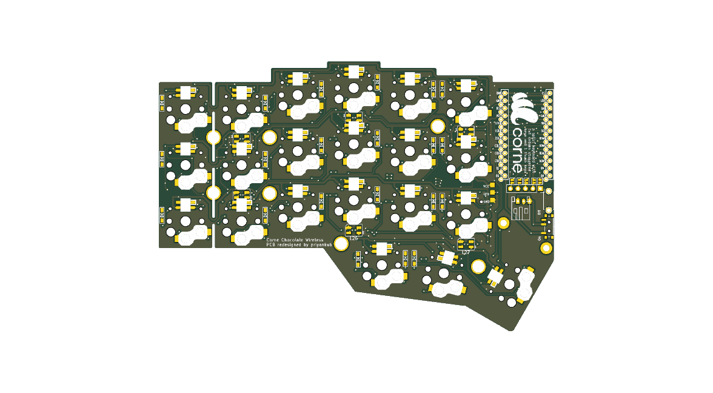

# Corne Chocolate Wireless

A modern, low-profile split ergonomic keyboard based on the Corne (crkbd) Chocolate v2.1 footprint. Designed for completely wireless operation with **nice!nano v2**, native **5-pin nice!view (Sharp Memory LCD)** support, onboard power management, and RGB backlighting.



---

## Key Features

* **Low-Profile Choc v1**: Kailh Choc PG1350 switches with hotswap sockets.
* **Native nice!view Header**: 5-pin pinout tailored specifically for nice!view and Sharp Memory LCD modules (`[CS, MOSI, SCK, VCC, GND]`) without adapter boards or bodge wires.
* **Dedicated Power Control**: Onboard slide power switch (PCM12) and 2-pin JST-PH 2.0mm LiPo battery connector routing power directly to the controller's `RAW` pin.
* **RGB Matrix & Underglow**: 27× SK6812MINI LEDs per side (6 underglow + 21 per-key).
  - WS2812 data line routed to **Pin 2 (P0.08 / D0)** to dedicate **Pin 1 (P0.06 / D1)** to the display Chip Select (`CS`).
* **Reversible PCB**: A single reversible PCB design is flipped for either the left or right hand.
* **ZMK Firmware Ready**: Complete ZMK configuration, keymap, and GitHub Actions build workflow included out of the box.

---

## Hardware Specifications & Pinout

### Microcontroller (nice!nano v2 / nRF52840)

| Signal | nice!nano Pin | nRF Pin | Function |
|:---|:---:|:---:|:---|
| **CS** | 1 (TX0 / D1) | `P0.06` | Display Chip Select |
| **LED** | 2 (RX1 / D0) | `P0.08` | WS2812 RGB Data |
| **SDA / MOSI** | 3 (D2) | `P0.17` | Display MOSI / I2C SDA |
| **SCL / SCK** | 4 (D3) | `P0.20` | Display SCK / I2C SCL |
| **RAW** | 24 | — | Battery positive (switched via power slide switch) |

### 5-Pin Display Connector Pinout

Viewed from the front (component side) with header pins at the bottom:

```text
Pin:    [ 1 ]      [ 2 ]      [ 3 ]      [ 4 ]      [ 5 ]
Signal:  CS        MOSI       SCK        VCC        GND
        (P0.06)    (P0.17)    (P0.20)   (3.3V)
```

---

## Assembly & Solder Jumpers

Because the PCB is reversible, you bridge the **5 solder jumpers** on the **top (active) side** of each half to route the display signals:

* **Left Hand (Top / Front side facing up)**:
  Solder jumpers **`JP1` through `JP5`** on the front layer (`F.Cu`).
  * `JP5` $\rightarrow$ Pin 1 (`CS`)
  * `JP4` $\rightarrow$ Pin 2 (`MOSI / SDA`)
  * `JP3` $\rightarrow$ Pin 3 (`SCK / SCL`)
  * `JP2` $\rightarrow$ Pin 4 (`VCC`)
  * `JP1` $\rightarrow$ Pin 5 (`GND`)

* **Right Hand (Bottom / Back side facing up)**:
  Solder jumpers **`JP6` through `JP10`** on the back layer (`B.Cu`).
  * `JP6` $\rightarrow$ Pin 1 (`CS`)
  * `JP7` $\rightarrow$ Pin 2 (`MOSI / SDA`)
  * `JP8` $\rightarrow$ Pin 3 (`SCK / SCL`)
  * `JP9` $\rightarrow$ Pin 4 (`VCC`)
  * `JP10` $\rightarrow$ Pin 5 (`GND`)

> [!TIP]
> Only solder the jumpers on the top side of each half. Leave the jumpers on the underside unbridged.

---

## Fabrication & Ordering

Ready-to-manufacture files are located in [`hardware/production/`](hardware/production/):

| File | Description |
|:---|:---|
| [`Corne_Chocolate_2.1.zip`](hardware/production/Corne_Chocolate_2.1.zip) | Complete Gerber & Drill archive (JLCPCB / PCBWay ready) |
| [`bom.csv`](hardware/production/bom.csv) | Bill of Materials with footprint designators |
| [`positions.csv`](hardware/production/positions.csv) | Pick & Place (CPL) component coordinates |
| [`netlist.ipc`](hardware/production/netlist.ipc) | IPC-D-356 electrical test netlist |

### Recommended Fab Settings (JLCPCB)
* **Base Material**: FR-4 (1.6mm thickness or 1.2mm for ultra-low profile)
* **Layers**: 2 layers
* **Surface Finish**: ENIG (recommended for hotswap durability) or HASL Lead-Free
* **Silkscreen**: Black PCB with white silkscreen (or standard preferences)
* **Castellated Holes**: No

---

## Firmware (ZMK)

The repository includes a battle-tested ZMK setup under [`firmware/`](firmware/):

* **Custom SPI Pinctrl**: Configures `P0.08` for the WS2812 LED chain, preserving `P0.06` for display `CS`.
* **Sleep & Power Management**: Deep sleep timeout set to 30 minutes with soft-off support.
* **ZMK Studio**: Enabled for real-time keymap remapping without reflashing.

### Building Firmware
Build using the included GitHub Actions workflow or locally with the ZMK toolchain:
```bash
west build -b nice_nano_v2 -d build/left -- -DSHIELD="corne_left nice_view_adapter nice_epaper"
west build -b nice_nano_v2 -d build/right -- -DSHIELD="corne_right nice_view_adapter nice_epaper"
```

---

## Repository Layout

```text
.
├── hardware/                  # KiCad 9 PCB and Schematic source files
│   ├── corne-chocolate.kicad_pro
│   ├── corne-chocolate.kicad_sch
│   ├── corne-chocolate.kicad_pcb
│   ├── corne-chocolate.step
│   ├── kbd/                   # KiCad symbol & footprint libraries
│   └── production/            # Gerbers, Drill, BOM, and CPL files
└── firmware/                  # ZMK configuration & build recipes
    ├── config/                # corne.keymap and corne.conf
    └── build.yaml             # GitHub Actions matrix configuration
```

---

<details>
<summary><b>Note for Prototype (First Batch) Builders</b></summary>

If you are working with an early prototype PCB printed before September 2026 (which had the display header signals routed in reverse order), you can run thin enamel jumper wires across the solder pads on the front of the left half instead of reprinting:
- `JP5 Pad 2` (Screen Pin 1 / CS) $\rightarrow$ Wire to `JP1 Pad 1`
- `JP4 Pad 2` (Screen Pin 2 / MOSI) $\rightarrow$ Wire to `JP5 Pad 1`
- `JP3 Pad 2` (Screen Pin 3 / SCK) $\rightarrow$ Wire to `JP4 Pad 1`
- `JP2 Pad 2` (Screen Pin 4 / VCC) $\rightarrow$ Wire to `JP3 Pad 1`
- `JP1 Pad 2` (Screen Pin 5 / GND) $\rightarrow$ Wire to `JP2 Pad 1`

*The files currently in this repository have this issue resolved natively in copper.*
</details>
