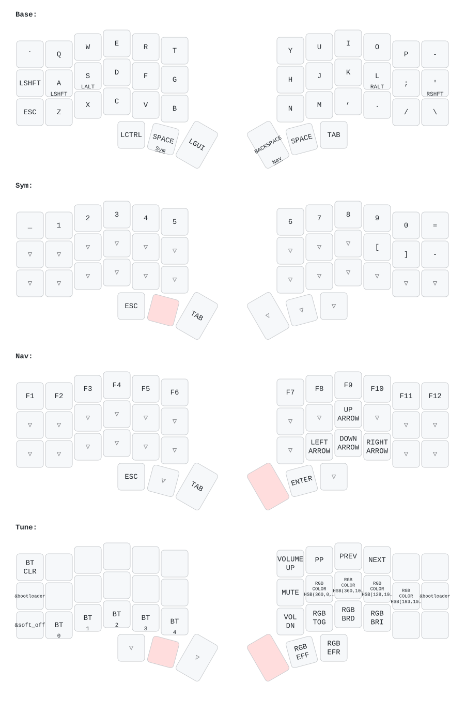

# Corne Chocolate ZMK Firmware

ZMK firmware configuration for the Corne Chocolate Wireless keyboard (nice!nano v2 + nice!view).

## Features

- **Controller**: nice!nano v2 (BLE nRF52840)
- **Displays**: nice!view / Sharp Memory LCD with custom display status screen
- **Backlight & Underglow**: RGB WS2812 strip with relocated data pin (`P0.08` / `D0`)
- **Realtime Mapping**: ZMK Studio support enabled

## Keymap Visualization

Keymap layout generated with [`keymap-drawer`](https://github.com/caksoylar/keymap-drawer):



## Building Firmware Locally

```bash
# Initialize west workspace
west init -l config
west update
west zephyr-export

# Build Left Half
west build -s zmk/app -d build/left -b nice_nano_v2 -S studio-rpc-usb-uart -- -DSHIELD="corne_left nice_view_adapter nice_epaper" -DZMK_CONFIG="$(pwd)/config"

# Build Right Half
west build -s zmk/app -d build/right -b nice_nano_v2 -- -DSHIELD="corne_right nice_view_adapter nice_epaper" -DZMK_CONFIG="$(pwd)/config"
```
